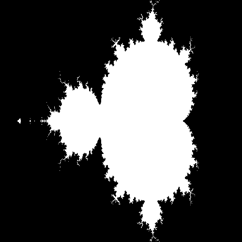
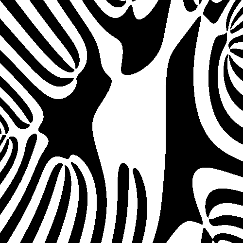
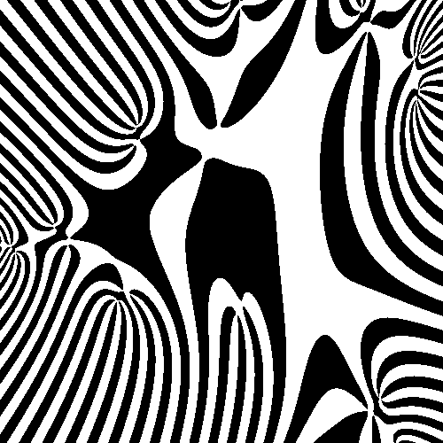

# Fractals

A little visor made for fun to check out fractals.

<div align="center">
    
    
    
</div>

# Usage

```bash
npm install
npm start
```

Try tweaking the parameters of `fractalMap` in `index.js` to get different results.
